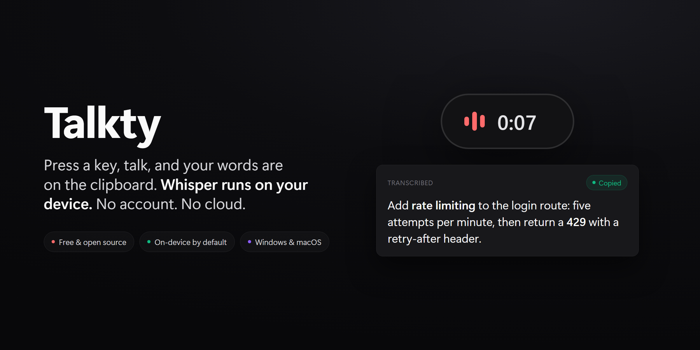
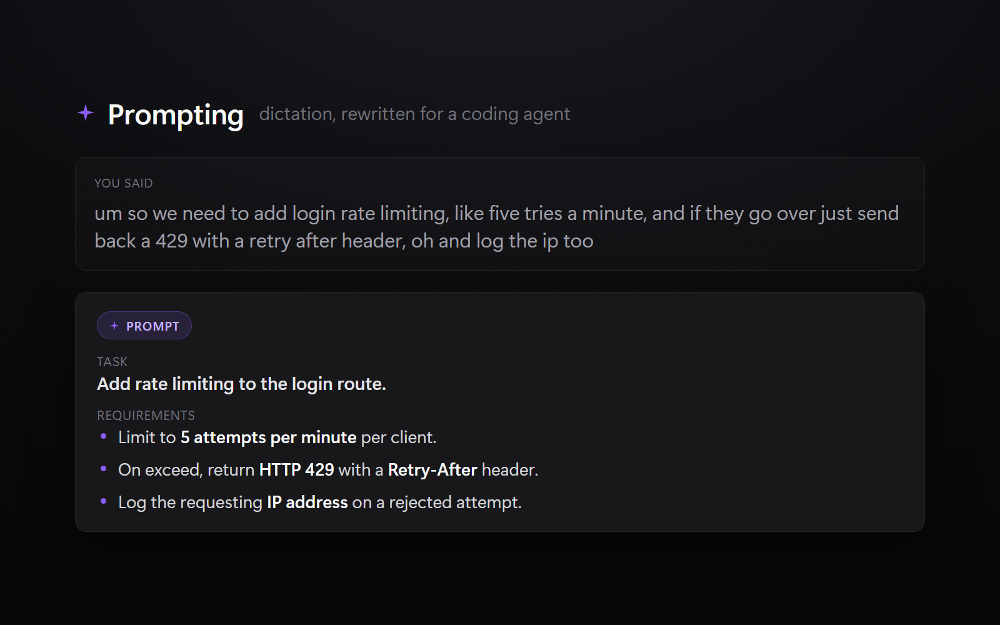

# Talkty for macOS

[](https://github.com/v2matosevic/talkty-mac/actions/workflows/ci.yml)
[](./LICENSE)
[](https://github.com/v2matosevic/talkty-mac/releases/latest)

[](https://github.com/v2matosevic/Talkty)

**Local speech-to-text for macOS, powered by Whisper.** Press a global hotkey,
speak, and your words land on the clipboard (and optionally type themselves at the
cursor). Everything runs on your Mac. No account, no internet, no telemetry. Free
and open source.



> On Windows too? There is a native build over at
> **[Talkty](https://github.com/v2matosevic/Talkty)** (.NET, CUDA and Vulkan
> acceleration). Same idea, built the right way for each platform.

This is a native Apple Silicon rebuild of the original Windows app: Metal
accelerated, menu-bar resident, fully on-device. Audio never leaves your Mac.

---

## Why

Most dictation tools send your microphone to someone else's server. That is a hard
no for a lot of what people say out loud: client work, half-formed ideas, anything
private. Talkty does the opposite. Whisper runs locally with Metal (and optionally
the Neural Engine), the audio is discarded the moment it becomes text, and nothing
leaves the device unless you deliberately turn on a cloud feature.

---

## Features

- **100% local.** whisper.cpp with Metal on Apple Silicon. Nothing leaves the device.
- **Fast.** Real-time factor around 0.01 to 0.1 on an M-series GPU. An 11 second clip
  transcribes in about 0.1 seconds.
- **Menu-bar app.** Press the hotkey from anywhere. A floating pill shows the live waveform.
- **Type at the cursor.** Optionally inserts text right where you are typing, with
  clipboard-safe keystroke injection. Ideal for editors and terminals.
- **Recording volume ducking.** Fades background audio down while you speak, then back up.
- **Quiet-mic friendly.** Boost-only auto-gain levels each take before transcription,
  and a mic input volume slider lives in Settings.
- **Clean output.** Re-joins false sentence breaks, strips Whisper hallucinations
  (like "Thanks for watching" and `[MUSIC]`), and applies a custom coding vocabulary.
- **In-app model manager.** Download Whisper models (Fast, Balanced, Accurate) with resume.
- **Cloud transcription** *(opt-in)*. Route a take through OpenRouter models for extra
  accuracy. Local stays the default.
- **Prompting mode** *(opt-in)*. Turn a dictation into a structured prompt for a coding
  AI agent before it hits the clipboard.


---

## Requirements

- Apple Silicon Mac (M1 or later), macOS 14 or newer
- About 150 MB plus the model you choose (75 MB to 3.1 GB)

## Install

1. Download `Talkty.dmg` from the [latest release](https://github.com/v2matosevic/talkty-mac/releases/latest).
2. Open it and drag **Talkty** into **Applications**.
3. First launch: the app is self-signed (not yet notarized), so Gatekeeper will
   block it the first time. Either right-click and choose **Open**, or run:
   ```bash
   xattr -dr com.apple.quarantine /Applications/Talkty.app
   ```
4. Look for the mic glyph in the menu bar. Grant **Microphone** when prompted. Grant
   **Accessibility** only if you turn on type-at-cursor. The global hotkey itself
   needs no special permission.

> Notarized builds (no Gatekeeper prompt) and a Homebrew cask are on the roadmap.

---

## Models

| Tier | Model | Size | Notes |
|------|-------|------|-------|
| Fast | tiny.en / base.en | 75 / 142 MB | English, quick notes |
| Balanced | small.en | 466 MB | English, everyday |
| Balanced | **large-v3-turbo** | 1.6 GB | 99+ languages, the all-round pick (recommended) |
| Accurate | medium.en | 1.5 GB | English, high accuracy |
| Accurate | large-v3 | 3.1 GB | 99+ languages, highest accuracy |

Models download from HuggingFace into `~/Library/Application Support/Talkty/Models/`.

### Optional: Neural Engine acceleration

Talkty is built with Core ML, so it can run Whisper's encoder on the Apple Neural
Engine (lower power than Metal alone). It is opt-in per model. Generate the encoder once:

```bash
Scripts/make_coreml.sh base.en        # or large-v3-turbo, large-v3, ...
```

That pulls torch and coremltools via `uv` (no Xcode needed) and installs
`ggml-<model>-encoder.mlmodelc` next to the model. Whisper picks it up automatically
and falls back to Metal when it is absent. The decoder always runs on Metal.

---

## Cloud and Prompting (both opt-in)

Two features trade a little privacy for accuracy or convenience. Both are off by
default and both run through a single [OpenRouter](https://openrouter.ai) API key
stored in the **macOS Keychain**, never on disk.

- **Cloud transcription** sends one recording to a hosted model when you select a
  cloud model in Settings. Local whisper.cpp stays the offline default otherwise.
- **Prompting** takes the words you just dictated and rewrites them into a clean,
  structured prompt for a coding agent (Claude Code, Cursor, Codex). It keeps every
  detail you said and drops the filler. If anything fails, it falls back to your raw
  transcription. See [docs/PROMPTING.md](./docs/PROMPTING.md) for the design.



Leave both off and Talkty stays 100% local.

---

## Build from source

```bash
brew install cmake                 # one-time build dependency
Scripts/bootstrap.sh               # vendor whisper.cpp (pinned) and build the Metal static libs
Scripts/make_app.sh release        # build, assemble, and sign dist/Talkty.app
open dist/Talkty.app
```

For stable Microphone and Accessibility grants across rebuilds, run
`Scripts/dev_identity.sh` once (it creates a local self-signed code-signing identity).
`make_app.sh` then signs with it automatically. `make_app.sh release --install` also
copies the build into `/Applications`. Open `Package.swift` in Xcode to edit.

Tests run with `.build/debug/TalktyTests` after `swift build` (no Xcode required,
Command Line Tools plus `cmake` is enough).

---

## Architecture

Swift 6 and SwiftUI over AppKit, with whisper.cpp (Metal, embedded shader) as the
only engine. See [CLAUDE.md](./CLAUDE.md) for the developer guide, the subsystem map,
and the hard-won gotchas (clean `_exit` teardown, first-load Metal compile, link order).

```
Sources/CWhisper     C bridge to whisper.h and ggml.h
Sources/TalktyKit    UI-agnostic logic (engine, audio, post-processing, services, models)
Sources/Talkty       The app (AppKit/SwiftUI shell, overlay, windows, state machine)
Tests/TalktyTests    Zero-dependency test harness (runs under Command Line Tools)
Scripts/             bootstrap, build_whisper, make_app, make_dmg, make_icon, dev_identity
```

---

## Contributing

Issues and pull requests are welcome. Start with [CONTRIBUTING.md](./CONTRIBUTING.md).
Keep `TalktyKit` UI-agnostic; the app layer owns all windows. Security policy and how
to report a vulnerability: [SECURITY.md](./SECURITY.md).

## License

[MIT](./LICENSE). Use it, fork it, ship it. Built by Marko Matošević at
[Version2](https://version2.hr).
